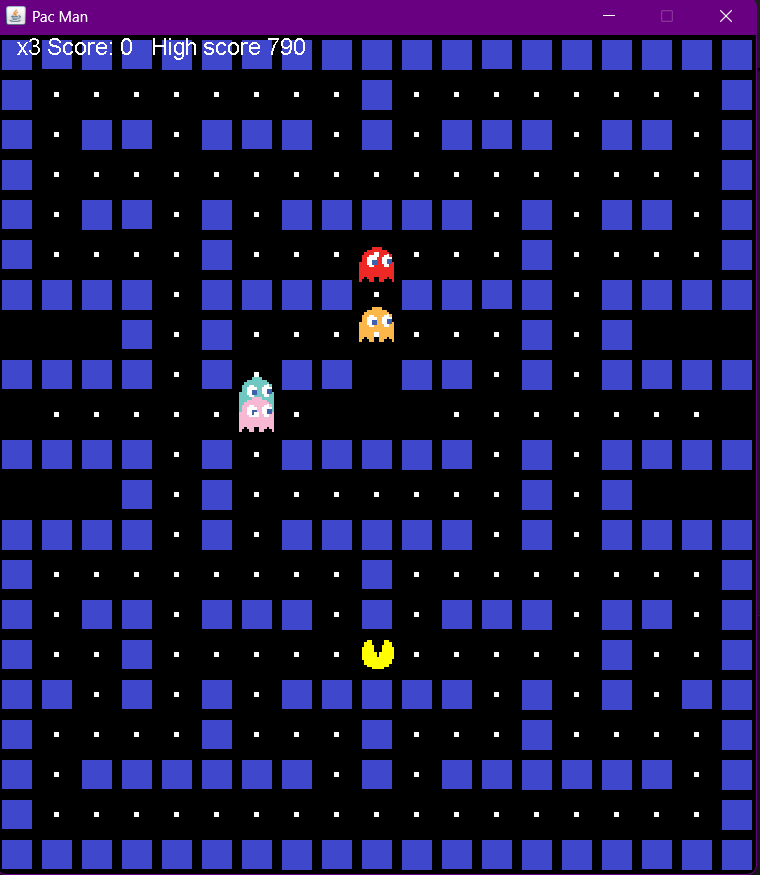

# 🟡 Pac-Man Java Game

A classic Pac-Man clone implemented in **Java** using **Swing** for desktop gameplay.

---

## 📸 Game Preview



---

## 🎮 Features

- Classic Pac-Man gameplay mechanics
- 4 colorful ghosts with AI movement
- Maze walls and food pellets
- Score tracking and high score system
- Lives system (3 lives)
- Game over and restart functionality
- Smooth arrow key controls
- Retro pixel art graphics

---

## 🎮 Controls

- **↑ ↓ ← → Arrow Keys** — Move Pac-Man around the maze
- **Any Key After Game Over** — Restart the game

---

## 🚀 Quick Start

### Option 1: Download and Play (Recommended)
1. Go to [Releases](https://github.com/SKSHAMKAUSHAL/PacMan/releases)
2. Download the latest `PacMan.jar` file
3. Double-click the JAR file or run: `java -jar PacMan.jar`

**Requirements:** Java 8+ installed on your system

### Option 2: Build from Source
```bash
# Clone the repository
git clone https://github.com/SKSHAMKAUSHAL/PacMan.git
cd PacMan

# Build using the provided script
# Windows:
build.bat

# Linux/Mac:
chmod +x start.sh
./start.sh
```

---

## 🏗️ Development

### Project Structure
```
PacMan/
├── src/
│   ├── App.java           # Main entry point
│   ├── PacMan.java        # Game logic and rendering
│   └── *.png              # Game sprites and assets
├── bin/                   # Compiled classes (auto-generated)
├── build.bat              # Windows build script
├── start.sh               # Linux/Mac build script
└── .github/workflows/     # Automated release builds
```

### Building Manually
```bash
# Compile
javac -d bin src/*.java

# Copy assets
cp src/*.png bin/

# Create JAR
cd bin && jar cfe PacMan.jar App *.class *.png
```

---

## 🤝 Contributing

1. Fork the repository
2. Create a feature branch: `git checkout -b feature-name`
3. Make your changes and test them
4. Commit: `git commit -m "Add feature"`
5. Push: `git push origin feature-name`
6. Create a Pull Request

---

## 📝 License

This project is open source. Feel free to use, modify, and distribute!

---

## 🎯 Future Enhancements

- [ ] Power pellets that make ghosts vulnerable
- [ ] Multiple maze levels
- [ ] Sound effects and background music
- [ ] Improved ghost AI patterns
- [ ] Bonus fruit items
- [ ] Web-based version using HTML5 Canvas

---

**Enjoy the game! 🎮**
